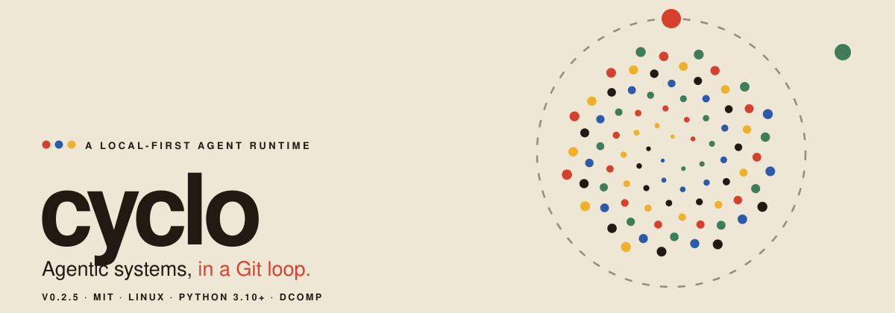

Cyclo runs Git-defined agent teams against explicitly mounted projects. A
credential gateway owns provider logins, optional provider components transform
or route model traffic, optional host edge components expose terminal APIs, and
each team runs as an isolated component with its own durable AgentWS queue.

Cyclo uses [DComp](https://github.com/glguida/dcomp) for Docker lifecycle and
component links. Cyclo builds images and compiles one realm-wide DComp system;
DComp reconciles its containers, networks, volumes, and crash-recovery state.
Neither program is in the inference data path after startup.

## 01 · Requirements

- Linux;
- Python 3.10 or newer;
- Git;
- a local Docker Engine reachable through a Unix socket; and
- a `dcomp` executable with machine API version 1.

Install DComp on `PATH`, or set `CYCLO_DCOMP` to its executable. Verify the
machine interface before using Cyclo:

```sh
"${CYCLO_DCOMP:-dcomp}" version --json
```

Cyclo refuses to build or run team workloads as host root. Run it as the user
who owns the project files and may access Docker.

Cyclo 0.2 is a fresh-install boundary. It does not import Cyclo 0.1 state or
Docker resources.

## 02 · First shared realm

Install the Python package. The default realm uses exactly these paths:

| Path | Purpose |
|---|---|
| `/etc/cyclo/host.conf` | Provider and host-component configuration |
| `/var/lib/cyclo/` | Realm state |

Cyclo does not prescribe, inspect, or rewrite their ownership, group, numeric
mode, or ACLs. It attempts to create and write the selected state path. If the
host filesystem allows the operation, Cyclo proceeds; otherwise it reports the
filesystem error. Because `/var/lib` is normally administrator-controlled, a
host administrator or package commonly creates that directory and grants the
intended operator access using the host's normal policy.

```sh
python3 -m pip install .
unset CYCLO_STATE_ROOT
```

Every account that the filesystem allows to use the same state root sees the
same gateway accounts, Provider graph, usage, teams, queues, and DComp system.
Edit the host configuration with `sudoedit`:

```sh
sudoedit /etc/cyclo/host.conf
```

The file may be empty, which routes teams directly to the gateway. Teams are
not entries in `host.conf`; `cyclo run` records them in the selected realm.

Inspect login providers, authenticate, and list the resulting models:

```sh
cyclo gateway providers
cyclo gateway login openai-codex --as codex-work
cyclo models
cyclo doctor
```

Login stores credentials in the gateway's private Docker volume and restarts
the gateway so the new catalogue is visible. In a fresh realm Cyclo
creates only that fixed gateway/store boundary first; unrelated host-component
or team failures cannot block login. API keys and OAuth sessions are never
mounted into provider or team components.

Rename or remove one stored account without touching the others:

```sh
cyclo gateway rename codex-work codex-personal
cyclo gateway logout codex-personal
```

Both operations restart only the gateway. Logout deletes Cyclo's local stored
credential; it does not revoke the token or session at the upstream provider.

## 03 · Provider composition

The gateway is always the root Provider. Each non-gateway provider is an
ordinary source directory containing `component.dcomp` and, when Cyclo should
build it, a `Dockerfile`:

```text
# providers/passthrough/component.dcomp
docker cyclo-passthrough:dev
input cyclo.provider.v1.Provider upstream
output cyclo.provider.v1.Provider provider
```

Install component instances in `host.conf`:

```text
provider trace ./providers/passthrough upstream=gateway.provider -- label=trace
provider policy ./providers/policy upstream=trace.provider
```

The grammar is:

```text
provider NAME SOURCE [context=PATH] INPUT=COMPONENT.OUTPUT ... [-- ARGUMENT ...]
```

Relative `SOURCE` paths resolve beside `host.conf`. `context=PATH` selects a
larger Docker build context containing the source. Every declared input must be
bound exactly once to an output with the same protobuf service name. All
declarations are resolved together, so links may refer to components written
later in the file. The last provider declaration is the outer Provider used by
teams and host-side catalogue calls; with no declarations, `gateway.provider`
is outer.

Cyclo ships a quota-aware Provider pooler as a bundled component source. Pool
every model shared by two gateway accounts with:

```text
provider pool pooler upstream=gateway.provider -- account-a account-b
```

This preserves the upstream catalogue and adds `pool/MODEL` for each shared
provider-local model ID. To pool only exact IDs under a chosen name:

```text
provider pool pooler upstream=gateway.provider -- account-a/model account-b/model model=balanced
```

The latter adds `pool/balanced`. Failover occurs only for typed pre-stream
resource exhaustion; the pooler never replays after emitting a response.

Cyclo uses stable realm/version tags for built gateway, Provider, and
team images. Whenever an operation needs one, Cyclo invokes `docker build` with
the real source context and lets Docker apply `.dockerignore` and its native
layer cache. Cyclo captures the build output, inspects the resulting immutable
image ID, and gives only that ID to DComp. It keeps no source-digest cache or
build history.

DComp gives each direct interface link a private internal TCP network.
Components receive only the targets for their declared inputs, such as
`DCOMP_LINK_UPSTREAM=dns:///trace:50051`.

Enable the bundled OpenAI HTTP edge independently of the Provider chain:

```text
component openai
```

This is a terminal component, not another Provider. Cyclo links its required
`provider` input to the final Provider selected above and publishes its OpenAI
Responses API at `http://127.0.0.1:8080/v1`. Select another literal IPv4 bind
address or host port with:

```text
component openai bind=0.0.0.0 port=18080
```

The bind address defaults to `127.0.0.1`. An explicit `0.0.0.0` exposes the
API on every host IPv4 interface, so use it only behind an appropriate trusted
network boundary. Apply changes with `cyclo repair`.

## 04 · Teams and projects

Create a team repository and a project definition:

```sh
cyclo team init ./teams/jon-rtl --template plan-execute-verify --model codex-work/MODEL
cyclo project init ./project.cyclo --context ./project-context.md --team ./teams/jon-rtl ro --mount core-et /home/user/openhw/core-et rw --mount specifications ./specifications ro
```

A project is a small line-oriented file:

```text
name rtl-work
description Integrate a reusable UART IP into CORE-ET.
context <<PROJECT_CONTEXT
`core-et` is the writable implementation repository.
`specifications` contains normative read-only interface documentation.
PROJECT_CONTEXT
team ./teams/jon-rtl ro
mount core-et /home/user/openhw/core-et rw
mount specifications ./specifications ro
```

Every `team` line creates one durable Cyclo instance and one generated DComp
team component. Writable mounts appear at `/workspace/<name>`; read-only inputs
appear at `/readonly/<name>`. Several writable mounts represent several
projects. The team repository is mounted at `/team` with its declared mode.
`cyclo run` persists each instance under
`STATE_ROOT/instances/INSTANCE/run.json`; teams are deliberately not copied
into `host.conf`.

Cyclo bakes AgentWS, Pi, the provider adapter, and the generic agent protocol
into the common team image. At runtime it mounts only durable queue directories,
Pi state, the team repository, the generated read-only
`/agentws/project.cyclo`, and declared project paths. Every team repository
contains a Dockerfile derived from Cyclo's standard team-component image:

```dockerfile
ARG CYCLO_TEAM_BASE
FROM ${CYCLO_TEAM_BASE}
USER root
RUN apt-get update && apt-get install -y --no-install-recommends verilator
```

The two-line `ARG`/`FROM` form is sufficient when no extra packages are needed.
Edit it to install the team's tools. Cyclo supplies `CYCLO_TEAM_BASE`; the final
stage must inherit it and preserve Cyclo's entrypoint and health check.

Run and inspect the project:

```sh
cyclo validate ./project.cyclo
cyclo run ./project.cyclo
cyclo ps
cyclo inspect INSTANCE
cyclo task run INSTANCE uart-ip ./uart-task.md
cyclo task add-job INSTANCE uart-ip uart-ip-builder-r1 builder ./recovery.md
cyclo task list INSTANCE
cyclo logs -f INSTANCE
cyclo dashboard --host 127.0.0.1
```

Jobs are routed by role. A team roster declares
`NAME ROLE ENGINE PROVIDER/MODEL`; the role selects both the queue work an agent
may claim and its `roles/ROLE.md` instructions. Several agents may share a role.
Task coordination authority belongs to role `planner`.

Use `cyclo refresh` to re-read running projects and teams, rebuild their images,
and apply the resulting realm-wide DComp system. Use `cyclo stop`,
`cyclo start`, and `cyclo forget` for durable instance intent. `cyclo repair`
runs the required host Docker builds and reapplies current host configuration
plus persisted instance intent. DComp resumes an interrupted matching target
or safely supersedes a stale target as part of `up`.

## 05 · Runtime model

One canonical state root defines one Cyclo realm and one DComp system:

```text
Cyclo CLI
  ├── runs Docker builds and validates immutable image IDs
  ├── stores project/team intent and AgentWS queues
  └── compiles gateway + host.conf components + running teams
                         │
                         v
                       DComp
  └── owns containers, link networks, volumes, and operation recovery
```

The gateway and outer Provider have explicitly published loopback endpoints for
host administration and model discovery. Team dashboards are published on the
address requested by `cyclo run`; the default is `127.0.0.1`. Normal teams have
external network access. `--offline` removes that access and the dashboard
publication while retaining the private Provider link.

The configured outer Provider is the only route. A failed component remains
inspectable through `cyclo component status` and makes the system
non-operational until it is fixed or removed from `host.conf`.

## 06 · Local and alternate realms

`--local` selects a self-contained private realm at
`${XDG_STATE_HOME:-$HOME/.local/state}/cyclo`. Its configuration is
`${XDG_STATE_HOME:-$HOME/.local/state}/cyclo/host.conf`; its gateway logins,
Provider graph, teams, queues, and DComp system are all independent of the
shared host realm:

```sh
cyclo --local doctor
# configuration: ${XDG_STATE_HOME:-$HOME/.local/state}/cyclo/host.conf
```

For a self-contained private realm with its own host configuration, select an
explicit root:

```sh
cyclo --state-root "$HOME/.local/state/cyclo-lab" doctor
# configuration: $HOME/.local/state/cyclo-lab/host.conf
```

`CYCLO_STATE_ROOT` is the environment equivalent. The canonical state-root path
determines the DComp system name, Docker resource namespace, image names,
gateway volume, teams, queues, and generated configuration. Consequently a
different explicit `host.conf` belongs to a different gateway/login realm.
Each realm binds itself to the selected local Docker Unix socket on its first
operation that needs one and rejects later attempts to retarget it.

## 07 · Documentation

- [Architecture](docs/architecture.md)
- [Operations guide](docs/guide.md)
- [Provider protocol](docs/provider-protocol.md)
- [Project format](docs/project-format.md)
- [Team repository contract](docs/team-repositories.md)
- [Security policy](SECURITY.md)

Cyclo ships its gateway, provider protocol, OpenAI edge, team runtime, AgentWS
runtime, dashboard, and team templates. DComp is a separate required
executable; external `agentws` and `multiagent` checkouts are not runtime
dependencies.


