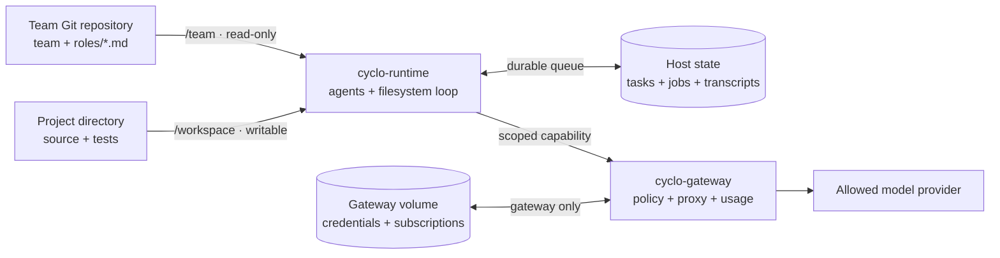

<p align="center">
  
</p>

<h1 align="center">Cyclo</h1>

<p align="center">
  <strong>Agentic systems, in a Git loop.</strong><br>
  Define teams as repositories, run them against real projects, and observe
  their work without putting provider credentials inside team containers.
</p>

<p align="center">
  <a href="#quick-start">Quick start</a> ·
  <a href="#how-it-works">How it works</a> ·
  <a href="#define-a-team">Define a team</a> ·
  <a href="#security-boundary">Security</a> ·
  <a href="#documentation">Documentation</a>
</p>

<p align="center">
  <code>v0.1.0</code> &nbsp; <code>stable</code> &nbsp;
  <code>Linux</code> &nbsp; <code>Python 3.10+</code> &nbsp; <code>MIT</code>
</p>

Cyclo is a local-first runtime for experimenting with multi-agent systems. A
team is ordinary Git content: a roster, role prompts, and an optional shared
protocol. Attach that team to any project directory, submit a task, and Cyclo
runs a durable filesystem job loop inside its own Docker container.

Model traffic crosses a separate credential gateway. API keys and subscription
sessions remain in a Docker-managed volume that team containers never mount;
each running team receives only a provider-and-model-scoped capability.

Cyclo is standalone. The queue runtime, agent launcher, read-only viewer,
credential gateway, Docker build contexts, templates, and fleet dashboard all
ship in this repository—there are no sibling checkouts or external agent
runtime to install.

## Why Cyclo

| Teams are software | Credentials stay outside |
|---|---|
| Version roles and model choices in a normal Git repository. Fork a team, compare generations, or deliberately let it self-modify. | Provider keys and OAuth subscriptions live only in the gateway store, never in a team repository, project, or team container. |
| **Work survives processes** | **The loop is visible** |
| Tasks, jobs, comments, results, and transcripts persist across container replacement and bounded agent retries. | A read-only dashboard shows fleet state, queue activity, attention items, and provider-reported token usage. |

## Quick start

Cyclo requires Linux, Python 3.10 or newer, Git, and a Docker daemon available
to the current user. From a Cyclo source checkout:

```sh
python3 -m venv .venv
. .venv/bin/activate
python -m pip install .
cyclo doctor
```

The host does not need Node.js or npm. The Pi agent engine and provider
libraries run inside Cyclo's images; Node.js is needed only for the full
maintainer test suite.

### 1. Connect a model provider

Provider discovery works before login:

```sh
cyclo gateway providers
cyclo gateway login openai-codex
cyclo models
```

The example uses a ChatGPT subscription through interactive OAuth. Cyclo also
supports Anthropic subscription login and API-key providers; the live
`cyclo gateway providers` output explains the available login routes, and
`cyclo models` is authoritative for roster model names.

### 2. Create a team

```sh
cyclo templates
cyclo init ~/teams/my-team \
  --template plan-execute-verify \
  --model PROVIDER/MODEL_ID
cyclo validate ~/teams/my-team
```

Replace `PROVIDER/MODEL_ID` with an exact value printed by `cyclo models`.
`cyclo init` creates an independent Git repository; edit and commit it like any
other source project.

### 3. Attach the team to a project

```sh
cyclo run --name my-team \
  ~/teams/my-team \
  ~/src/my-project
```

The team definition is read-only by default. The project is writable by
default, so agents can change its source and tests. Cyclo prints the instance
name, project root, persistent queue path, and per-team viewer URL.

### 4. Give it work

```sh
$EDITOR /tmp/task.md
cyclo task my-team task-001 /tmp/task.md
cyclo logs -f my-team
```

The task specification describes the desired outcome in the attached project;
it does not need to mention an internal container path. Open the fleet view in
another terminal:

```sh
cyclo dashboard
```

## How it works



Each instance has its own runtime container, private Docker network, persistent
queue state, and scoped gateway capability. The gateway is the only component
that mounts the credential volume, and it attributes provider-reported usage
to the team/project binding and team generation.

A submitted task begins with a planner job. Agents claim jobs matching their
roles, write evidence and results to the filesystem queue, and create follow-up
jobs for the next role. The wrapper keeps every agent available for later work;
the team stops only when you stop the instance.

## Define a team

A minimal team repository looks like this:

```text
my-team/
  team
  roles/
    planner.md
    builder.md
    verifier.md
  AGENTS.md              # optional shared protocol
```

The `team` roster assigns every agent a role, engine, and gateway model:

```text
# <name>       <role>    <engine>        <provider/model>
planner-1      planner   pi              openai-codex/MODEL_ID
builder-1      builder   pi              openai-codex/MODEL_ID
verifier-1     verifier  pi-interactive  anthropic/MODEL_ID
```

Every role needs a matching `roles/<role>.md`, and at least one agent must have
the `planner` role. A team can mix models or providers. When `AGENTS.md` is
absent, Cyclo supplies its bundled filesystem-loop protocol.

Use `--team-write` only when a team should edit its own roster or roles; those
ordinary Git working-tree changes take effect on the next run.

## Included loops

| Template | Flow |
|---|---|
| `plan-execute-verify` | Planner → builder → critic/revision → independent verifier |
| `test-driven-repair` | Reproduce and test → repair → judge → integrate |
| `adversarial-audit` | Threat model → parallel inspection → challenge → evidence synthesis |

List them with `cyclo templates`. A created team is a normal, independent Git
repository with no runtime link back to Cyclo's template copy.

## Observe and operate

```sh
cyclo ps
cyclo dashboard
cyclo usage
cyclo path my-team
cyclo stop my-team
```

The dashboard combines lifecycle state, bounded queue summaries, recent
task/job activity, and gateway usage across all instances. It and the per-team
AgentWS viewer are read-only and bind to loopback by default.

To expose the dashboard on a trusted network, bind it explicitly and browse to
the machine's real hostname or IP—not to the bind address `0.0.0.0`:

```sh
cyclo dashboard --host 0.0.0.0 --port 4173
# browse to http://<machine-host>:4173/
```

Version 0.1.0 has no application authentication. Keep the default loopback bind
unless network access is already controlled.

## Security boundary

The team container receives its team mount, project mount, durable job state,
and a writable Pi state tree containing its scoped gateway capability. It does
**not** receive provider credentials, subscription files, the credential
volume, gateway administrator token, host home directory, Docker socket, or
another team's state.

This isolates credentials; it is not a general-purpose sandbox or data-loss
prevention system. An agent can send readable project content to an allowed
model provider. `--offline` blocks direct outbound networking while preserving
gateway access, and `--project-read-only` removes project write access. See the
[architecture](docs/architecture.md) and [security policy](SECURITY.md) for the
full trust model.

## Documentation

| Document | What it covers |
|---|---|
| [User guide](docs/guide.md) | Complete installation, provider, runtime, retry, operation, mount, and persistent-state reference |
| [Architecture](docs/architecture.md) | Components, generations, networks, state, and trust boundaries |
| [Team templates](template/README.md) | The bundled loops and how to customize them |
| [Security policy](SECURITY.md) | Supported versions, reporting, and explicit guarantees |
| [Release guide](docs/releasing.md) | Reproducible local build and verification procedure |
| [Changelog](CHANGELOG.md) | Version history |

Run `cyclo --help` for the command index and `cyclo COMMAND --help` for exact
options.

## Development

```sh
python3 -m pip install -e .
python3 -m pytest -q
node --test tests/*.mjs
```

Cyclo 0.1.0 is a stable release. It is distributed as `cyclo-agent`; the
command, Python package, repository, and product remain `cyclo` and Cyclo.

## License

Cyclo is released under the [MIT License](LICENSE).
